# MongoDB Proposed ERD

> [!NOTE]
> This ERD is a proposed structure for the MongoDB database, designed to replace the existing SQL database structure. Hard references to other collections have been purposely avoided to help maintain schema flexibility. The only (optional when querying) hard references are between the `Holding` and `Incidents` collections.

```mermaid
erDiagram
    Holding {
        _id ObjectId PK "NOT NULL"
        details Details "NOT NULL"
        incidents ObjectId[] "NULLABLE"
    }
    
    Details {
        cph string "INDEXED NOT NULL"
        name string "NOT NULL"
        description string "NOT NULL"
        address Address "NOT NULL"
        geolocation Geolocation "NOT NULL"
    }
    
    Address {
        street string "NOT NULL"
        locality string "NOT NULL"
        town string "NOT NULL"
        county string "NOT NULL"
        postcode string "NOT NULL"
    }
    
    Contact {
        type string "NOT NULL"
        value string "NOT NULL"
    }
    
    Geolocation {
        mapRef string "NOT NULL"
        easting string "NOT NULL"
        northing string "NOT NULL"
    }
    
    Incidents {
        _id ObjectId PK "NOT NULL"
        nat_incident_no string "INDEXED NOT NULL"
        holding ObjectId "NOT NULL"
        assignedTo AssignedTo "NULLABLE"
        tbStatus string "NULLABLE"
        tbResult string "NULLABLE"
        slaughterHouseCase BOOLEAN "NULLABLE"
        empb BOOLEAN "NULLABLE"
        approvedFinishing ApprovedFinishing "NOT NULL"
        restrictionDetails RestrictionDetails "NOT NULL"
        allocationDetails AllocationDetails "NOT NULL"
        gisOps GisOps "NOT NULL"
        contiguousTestingDetails ContiguousTestingDetails "NOT NULL"
        drfVisitDetails drfVisitDetails "NOT NULL"
        traceDetails TraceDetails "NOT NULL"
        postKillDetails PostKillDetails "NOT NULL"
        eartags Eartag[] "NOT NULL"
        removals Removal[] "NOT NULL"
        generalComments Comment "NULLABLE"
        dashboardComments Comment "NULLABLE"
    }

    ApprovedFinishing {
        lots integer "NULLABLE"
        completedDate DateTime "NULLABLE"
    }
    
    AssignedTo {
        vet string "NULLABLE"
        admin string "NULLABLE"
    }
    
    RestrictionDetails {
        tt2Date DateTime "NULLABLE"
        tb2ServedDate DateTime "NULLABLE"
        tb10Date DateTime
        bt5Date DateTime "NULLABLE"
    }
    
    GisOps {
        notRequired BOOLEAN "NULLABLE"
        mapCreatedDate DATETIME "NULLABLE"
        comments Comment "NULLABLE"
        gisAdmin string "NULLABLE"
        vet string "NULLABLE"
    }

    ContiguousTestingDetails {
        notRequired BOOLEAN "NULLABLE"
        species BOOLEAN "NULLABLE"
        colocatedOtherSpecies BOOLEAN "NULLABLE"
        admin string "NULLABLE"
        instigationDate DateTime "NULLABLE"
        notificationDate DateTime "NULLABLE"
        finalPmDate DateTime "NULLABLE"
        testCount integer "NULLABLE"
        actionsComplete BOOLEAN "NULLABLE"
        comments Comment "NULLABLE"
    }

    PostKillDetails {
        admin string "NULLABLE"
        tbResult string "NULLABLE"
        confirmationDate DateTime "NULLABLE"
        imt21SendDate DateTime "NULLABLE"
        comments Comment "NULLABLE"
    }

    DrfVisitDetails {
        notRequired BOOLEAN "NULLABLE"
        auditVisit BOOLEAN "NULLABLE"
        phoneVisit string "NULLABLE"
        failureCategory string "NULLABLE"
        slaughterHouseMapRequestDate DateTime "NULLABLE"
        reactor BOOLEAN "NULLABLE"
        publicAccess BOOLEAN "NULLABLE"
        noPreviousVisit BOOLEAN "NULLABLE"
        fieldInfDate DateTime "NULLABLE"
        initialCompletedDate DateTime "NULLABLE"
        finalCompletedDate DateTime "NULLABLE"
        late BOOLEAN "NULLABLE"
        vetNotifiedBy string "NULLABLE" 
        vet string "NULLABLE"
        comments Comment "NULLABLE"
    }

    TraceDetails {
        gp integer "NULLABLE"
        wss string "NULLABLE"
        sourceWS string "NULLABLE"
        spreadWS string "NULLABLE"
        notifiedDate DateTime "NULLABLE"
        wsToCardiffDate DateTime "NULLABLE"
        drfCheckedDate DateTime "NULLABLE"
        admin string "NULLABLE"
        vet string "NULLABLE"
        comments Comment "NULLABLE"
    }

    Eartag {
        eartag string "NULLABLE"
        ws string "NULLABLE"
        wsa string "NULLABLE"
        wss string "NULLABLE"
        breed string "NULLABLE"
        sex string "NULLABLE"
        dob DateTime "NULLABLE"
        pedigree BOOLEAN "NULLABLE"
        slaughter BOOLEAN "NULLABLE"
        select BOOLEAN "NULLABLE"
    }

    Removal {
        tt2 DateTime "NULLABLE"
        testType string "NULLABLE"
        ws string "NULLABLE"
        admin string "NULLABLE"
        valDate DateTime "NULLABLE"
        valCallBack BOOLEAN "NULLABLE"
        reactor ReactorDetails "NULLABLE"
        killDetails KillDetails "NULLABLE"
        pmeDate DateTime "NULLABLE"
        pedigree PedigreeCertificateDetails "NULLABLE"
        abattoir AbattoirDetails "NULLABLE"
        dnaProblem BOOLEAN "NULLABLE"
        removalNotifications RemovalNotifications "NULLABLE"
        removalComments Comment "NULLABLE"
        reasonForChange string "NULLABLE"
    }

    ReactorDetails {
        count integer "NULLABLE"
        priorityCount integer "NULLABLE"
    }

    KillDetails {
        killDate DateTime "NULLABLE"
        killedOnFarm integer "NULLABLE"
        killedOnFarmReason integer "NULLABLE"
        originalKill BOOLEAN "NULLABLE"
        originalKillDate DateTime "NULLABLE"
    }

    PedigreeCertificateDetails {
        online integer "NULLABLE"
        certificate integer "NULLABLE"
        receivedDate DateTime "NULLABLE"
    }

    AbattoirDetails {
        abattoirRef string "NULLABLE"
        abattoir string "NULLABLE"
        lateCategory string "NULLABLE"
    }

    RemovalNotifications {
        tb161Sent DateTime "NULLABLE"
        tb161Received DateTime "NULLABLE"
        tb161Sam DateTime "NULLABLE"
        bt1Sent DateTime "NULLABLE"
        bt1NotSentCategory string "NULLABLE"
        tb161Comment string "NULLABLE"
    }

    AllocationDetails {
        notRequired BOOLEAN "NULLABLE"
        bookingDate DateTime "NULLABLE"
        bookingMethod string "NULLABLE"
        calendar BOOLEAN "NULLABLE"
        sam BOOLEAN "NULLABLE"
        slimData DateTime "NULLABLE"
        emailSentTo string "NULLABLE"
        comments Comment "NULLABLE"
    }

    Comment {
        comment string "NOT NULL"
        createdAt DateTime "NOT NULL"
        createdBy string "NOT NULL"
    }
    
    TbStatus {
        _id ObjectId PK "NOT NULL"
        code string "NOT NULL"
        description string "NOT NULL"
        validRegions string "NOT NULL"
    }

    TbResult {
        _id ObjectId PK "NOT NULL"
        code string "NOT NULL"
        description string "NOT NULL"
    }
    
    AllocationBookingMethod {
        _id ObjectId PK "NOT NULL"
        method string "NOT NULL"
    }
    
    AllocationSkipReasons {
        _id ObjectId PK "NOT NULL"
        reason string "NOT NULL"
    }
    
    %% Relationships (Embedded Documents)
    Holding ||--|| Details : "embeds"
    Details ||--|| Address : "embeds"
    Details ||--|| Geolocation : "embeds"
    Details ||--o{ Contact : "embeds array"
    Incidents ||--o| AssignedTo : "embeds"
    Incidents ||--o| ApprovedFinishing : "embeds"
    Incidents ||--o| NotificationEvents : "embeds"
    Incidents ||--o| GisOps : "embeds"
    Incidents ||--o| AllocationDetails : "embeds"
    Incidents ||--o| ContiguousTestingDetails : "embeds"
    Incidents ||--o| DrfVisitDetails : "embeds"
    Incidents ||--o| TraceDetails : "embeds"
    Incidents ||--o| PostKillDetails : "embeds"
    Incidents ||--o{ Eartag : "embeds array"
    Incidents ||--o{ Removal : "embeds array"
    Removal ||--o| ReactorDetails : "embeds"
    Removal ||--o| KillDetails : "embeds"
    Removal ||--o| PedigreeCertificateDetails : "embeds"
    Removal ||--o| AbattoirDetails : "embeds"
    Removal ||--o| RemovalNotifications : "embeds"
    Incidents }o--|| Holding : "references"
```

## SQL to MongoDB Field Mapping

### 1. Holding Collection

> **Source:** `cpht` table  
> **Purpose:** Central holding property information with embedded address and geolocation data

| MongoDB Path | SQL Source | Notes |
|--------------|------------|-------|
| `Holding._id` | Generated ObjectId | New MongoDB primary key |
| `Holding.details` | Embedded from `cpht` | Complete holding details |
| `Holding.incidents` | Array of ObjectId references | Links to Incidents collection |

#### 1.1 Holding.Details (Embedded Document)

| MongoDB Path | SQL Source | Notes |
|--------------|------------|-------|
| `Holding.details.cph` | `cpht.cph` | Primary key from cpht |
| `Holding.details.name` | `cpht.cph_name` | |
| `Holding.details.description` | `cpht.description` | |
| `Holding.details.address` | Embedded object | |
| `Holding.details.geolocation` | Embedded object | |

#### 1.2 Holding.Details.Address (Embedded Document)

| MongoDB Path | SQL Source | Notes |
|--------------|------------|-------|
| `Holding.details.address.street` | `cpht.street` | |
| `Holding.details.address.locality` | `cpht.locality` | |
| `Holding.details.address.town` | `cpht.town` | |
| `Holding.details.address.county` | `cpht.county` | |
| `Holding.details.address.postcode` | `cpht.postcode` | |

#### 1.3 Holding.Details.Contact (Embedded Array)

| MongoDB Path | SQL Source | Notes |
|--------------|------------|-------|
| `Holding.details.comments[].type` | Derived | "landline" or "mobile" |
| `Holding.details.comments[].value` | `cpht.landline` or `cpht.mobile` | |

#### 1.4 Holding.Details.Geolocation (Embedded Document)

| MongoDB Path | SQL Source | Notes |
|--------------|------------|-------|
| `Holding.details.geolocation.mapRef` | `cpht.map_ref` | |
| `Holding.details.geolocation.easting` | `cpht.easting` | |
| `Holding.details.geolocation.northing` | `cpht.northing` | |

---

### 2. Incidents Collection

> **Source:** `case_t` table  
> **Purpose:** TB incident cases with all associated testing, allocation, and administrative details

| MongoDB Path | SQL Source | Notes |
|--------------|------------|-------|
| `Incidents._id` | Generated ObjectId | New MongoDB primary key |
| `Incidents.nat_incident_no` | `case_t.nat_inc` | Original primary key |
| `Incidents.holding` | `case_t.cph` | Reference to Holding collection |
| `Incidents.tbStatus` | `case_t.tb_status` | |
| `Incidents.tbResult` | `case_t.result` | |
| `Incidents.slaughterHouseCase` | `case_t.slh` | |
| `Incidents.empb` | `case_t.empb` | |
| `Incidents.generalComments` | `case_t.gen_comment` | |
| `Incidents.dashboardComments` | `case_t.dashboard_comment` | |
| `Incidents.eartags` | Embedded array | From `eartag_temp_t` |
| `Incidents.removals` | Embedded array | From `removal_t` |

#### 2.1 Incidents.AssignedTo (Embedded Document)

| MongoDB Path | SQL Source | Notes |
|--------------|------------|-------|
| `Incidents.assignedTo.vet` | `case_t.case_vo` | |
| `Incidents.assignedTo.admin` | `case_t.case_admin` | |

#### 2.2 Incidents.ApprovedFinishing (Embedded Document)

| MongoDB Path | SQL Source | Notes |
|--------------|------------|-------|
| `Incidents.approvedFinishing.lots` | `case_t.afu` | |
| `Incidents.approvedFinishing.completedDate` | `case_t.afu_completed_date` | |

#### 2.3 Incidents.RestrictionDetails (Embedded Document)

| MongoDB Path | SQL Source | Notes |
|--------------|------------|-------|
| `Incidents.restrictionDetails.tt2Date` | `case_t.tt2` | |
| `Incidents.restrictionDetails.tb2ServedDate` | `case_t.tb2_served` | |
| `Incidents.restrictionDetails.tb10Date` | `case_t.tb10` | |
| `Incidents.restrictionDetails.bt5Date` | `case_t.bt5_sent_date` | |

#### 2.4 Incidents.AllocationDetails (Embedded Document)

| MongoDB Path | SQL Source | Notes |
|--------------|------------|-------|
| `Incidents.allocationDetails.notRequired` | `case_t.all_not_req` | |
| `Incidents.allocationDetails.bookingDate` | `case_t.allc_booked_for` | |
| `Incidents.allocationDetails.bookingMethod` | `case_t.allc_booking_method` | |
| `Incidents.allocationDetails.calendar` | `case_t.allc_calendar` | |
| `Incidents.allocationDetails.sam` | `case_t.allc_sam` | |
| `Incidents.allocationDetails.slimData` | `case_t.allc_drf_inf_date` | |
| `Incidents.allocationDetails.emailSentTo` | `case_t.allc_email_sent_by` | |
| `Incidents.allocationDetails.comments` | `case_t.allc_comment` | |

#### 2.5 Incidents.GisOps (Embedded Document)

| MongoDB Path | SQL Source | Notes |
|--------------|------------|-------|
| `Incidents.gisOps.notRequired` | `case_t.gis_not_req` | |
| `Incidents.gisOps.mapCreatedDate` | `case_t.gis_map_created` | |
| `Incidents.gisOps.gisAdmin` | `case_t.gis_admin` | |
| `Incidents.gisOps.vet` | `case_t.drf_field_staff` | |
| `Incidents.gisOps.comments` | `case_t.gis_comment` | |

#### 2.6 Incidents.ContiguousTestingDetails (Embedded Document)

| MongoDB Path | SQL Source | Notes |
|--------------|------------|-------|
| `Incidents.contiguousTestingDetails.notRequired` | `case_t.cons_not_req` | |
| `Incidents.contiguousTestingDetails.species` | `case_t.con_species` | |
| `Incidents.contiguousTestingDetails.colocatedOtherSpecies` | `case_t.co_located_other_species` | |
| `Incidents.contiguousTestingDetails.admin` | `case_t.con_admin` | |
| `Incidents.contiguousTestingDetails.instigationDate` | `case_t.date_contigs_instigated` | |
| `Incidents.contiguousTestingDetails.notificationDate` | `case_t.date_contigs_notified` | |
| `Incidents.contiguousTestingDetails.finalPmDate` | `case_t.final_pm_date` | |
| `Incidents.contiguousTestingDetails.testCount` | `case_t.number_contigs` | |
| `Incidents.contiguousTestingDetails.actionsComplete` | `case_t.cons_complete` | |
| `Incidents.contiguousTestingDetails.comments` | `case_t.con_comment` | |

#### 2.7 Incidents.DrfVisitDetails (Embedded Document)

| MongoDB Path | SQL Source | Notes |
|--------------|------------|-------|
| `Incidents.drfVisitDetails.notRequired` | `case_t.drf_not_req` | |
| `Incidents.drfVisitDetails.auditVisit` | `case_t.drf_ten_percent_audit` | |
| `Incidents.drfVisitDetails.phoneVisit` | `case_t.drf_phone_visit` | |
| `Incidents.drfVisitDetails.failureCategory` | `case_t.drf_fail_cat` | |
| `Incidents.drfVisitDetails.slaughterHouseMapRequestDate` | `case_t.drfslh_map_request_date` | |
| `Incidents.drfVisitDetails.reactor` | `case_t.drf_reactor_num` | |
| `Incidents.drfVisitDetails.publicAccess` | `case_t.drf_public_access` | |
| `Incidents.drfVisitDetails.noPreviousVisit` | `case_t.drf_no_previous` | |
| `Incidents.drfVisitDetails.fieldInfDate` | `case_t.drf_field_inf_date` | |
| `Incidents.drfVisitDetails.initialCompletedDate` | `case_t.initial_drf_completed_date` | |
| `Incidents.drfVisitDetails.finalCompletedDate` | `case_t.final_drf_completed_date` | |
| `Incidents.drfVisitDetails.late` | `case_t.drf_late` | |
| `Incidents.drfVisitDetails.vetNotifiedBy` | `case_t.drfvo_notified_admin` | |
| `Incidents.drfVisitDetails.vet` | `case_t.drf_field_staff` | |
| `Incidents.drfVisitDetails.comments` | `case_t.drf_comments` | |

#### 2.8 Incidents.TraceDetails (Embedded Document)

| MongoDB Path | SQL Source | Notes |
|--------------|------------|-------|
| `Incidents.traceDetails.gp` | `case_t.trace_gp` | |
| `Incidents.traceDetails.wss` | `case_t.trac_wss` | |
| `Incidents.traceDetails.sourceWS` | `case_t.trac_source_ws` | |
| `Incidents.traceDetails.spreadWS` | `case_t.trac_spread_ws` | |
| `Incidents.traceDetails.notifiedDate` | `case_t.trac_notified_date` | |
| `Incidents.traceDetails.wsToCardiffDate` | `case_t.trac_ws_to_cardiff_date` | |
| `Incidents.traceDetails.drfCheckedDate` | `case_t.trac_drf_checked_date` | |
| `Incidents.traceDetails.admin` | `case_t.trac_admin` | |
| `Incidents.traceDetails.vet` | Derived from staff assignments | |
| `Incidents.traceDetails.comments` | `case_t.trac_comments` | |

#### 2.9 Incidents.PostKillDetails (Embedded Document)

| MongoDB Path | SQL Source | Notes |
|--------------|------------|-------|
| `Incidents.postKillDetails.admin` | `case_t.pk_admin` | |
| `Incidents.postKillDetails.tbResult` | `case_t.result` | |
| `Incidents.postKillDetails.confirmationDate` | `case_t.confirmation_date` | |
| `Incidents.postKillDetails.imt21SendDate` | `case_t.imt21_sent_date` | |
| `Incidents.postKillDetails.comments` | `case_t.pk_comment` | |

---

### 3. Eartag Array (Embedded in Incidents)

> **Source:** `eartag_temp_t` table  
> **Purpose:** Animal ear tag information associated with incidents

| MongoDB Path | SQL Source | Notes |
|--------------|------------|-------|
| `Incidents.eartags[].eartag` | `eartag_temp_t.eartag` | Primary key |
| `Incidents.eartags[].ws` | `eartag_temp_t.ws` | |
| `Incidents.eartags[].wsa` | `eartag_temp_t.wsa` | |
| `Incidents.eartags[].wss` | `eartag_temp_t.wss` | |
| `Incidents.eartags[].breed` | `eartag_temp_t.breed` | |
| `Incidents.eartags[].sex` | `eartag_temp_t.sex` | |
| `Incidents.eartags[].dob` | `eartag_temp_t.dob` | |
| `Incidents.eartags[].pedigree` | `eartag_temp_t.pedigree` | |
| `Incidents.eartags[].slaughter` | `eartag_temp_t.slaughter` | |
| `Incidents.eartags[].select` | `eartag_temp_t.select` | |

---

### 4. Removal Array (Embedded in Incidents)

> **Source:** `removal_t` table  
> **Purpose:** Animal removal and testing information for incidents

| MongoDB Path | SQL Source | Notes |
|--------------|------------|-------|
| `Incidents.removals[].tt2` | `removal_t.tt2` | |
| `Incidents.removals[].testType` | `removal_t.test_type` | |
| `Incidents.removals[].ws` | `removal_t.ws` | |
| `Incidents.removals[].admin` | `removal_t.admin` | |
| `Incidents.removals[].valDate` | `removal_t.val_date` | |
| `Incidents.removals[].valCallBack` | `removal_t.val_call_back` | |
| `Incidents.removals[].dnaProblem` | `removal_t.dna_problem` | |
| `Incidents.removals[].reasonForChange` | `removal_t.reason_for_change` | |
| `Incidents.removals[].removalComments` | `removal_t.rem_comment` | |

#### 4.1 Removal.ReactorDetails (Embedded Document)

| MongoDB Path | SQL Source | Notes |
|--------------|------------|-------|
| `Incidents.removals[].reactor.count` | `removal_t.no_reactor` | |
| `Incidents.removals[].reactor.priorityCount` | `removal_t.no_priority_reactors` | |

#### 4.2 Removal.KillDetails (Embedded Document)

| MongoDB Path | SQL Source | Notes |
|--------------|------------|-------|
| `Incidents.removals[].kill.killDate` | `removal_t.kill_date` | |
| `Incidents.removals[].kill.killedOnFarm` | `removal_t.killed_on_farm` | |
| `Incidents.removals[].kill.killedOnFarmReason` | `removal_t.killed_on_farm_reason` | |
| `Incidents.removals[].kill.originalKill` | `removal_t.original_kill` | |
| `Incidents.removals[].kill.originalKillDate` | `removal_t.original_kill_date` | |

#### 4.3 Removal.PedigreeCertificateDetails (Embedded Document)

| MongoDB Path | SQL Source | Notes |
|--------------|------------|-------|
| `Incidents.removals[].pedigree.online` | `removal_t.ped_on_line` | |
| `Incidents.removals[].pedigree.certificate` | `removal_t.ped_cert` | |
| `Incidents.removals[].pedigree.receivedDate` | `removal_t.ped_cert_rec_date` | |

#### 4.4 Removal.AbattoirDetails (Embedded Document)

| MongoDB Path | SQL Source | Notes |
|--------------|------------|-------|
| `Incidents.removals[].abattoir.abattoirRef` | `removal_t.ab_ref_no` | |
| `Incidents.removals[].abattoir.abattoir` | `removal_t.ab` | |
| `Incidents.removals[].abattoir.lateCategory` | `removal_t.late_cat` | |

#### 4.5 Removal.RemovalNotifications (Embedded Document)

| MongoDB Path | SQL Source | Notes |
|--------------|------------|-------|
| `Incidents.removals[].removalNotifications.tb161Sent` | `removal_t.tb161_sent` | |
| `Incidents.removals[].removalNotifications.tb161Received` | `removal_t.tb161_rec` | |
| `Incidents.removals[].removalNotifications.tb161Sam` | `removal_t.tb161_sam` | |
| `Incidents.removals[].removalNotifications.bt1Sent` | `removal_t.bt1_sent` | |
| `Incidents.removals[].removalNotifications.bt1NotSentCategory` | `removal_t.bt1_not_sent_cat` | |
| `Incidents.removals[].removalNotifications.tb161Comment` | `removal_t.tb161_comment` | |
