# TBCMS MongoDB Schema - Entity Relationship Diagram

## Analysis Phase Results

### 1. SQL Case Table Structure Analysis

The `case` table from the SQL schema represents the core entity in the TBCMS (Tuberculosis Case Management System). Based on the Liquibase changelog analysis, the table contains:

#### Primary Key
- `nat_inc` (VARCHAR(10)) - TB National Incident Number (Primary Key)

#### Foreign Key Relationships
- `cph` (VARCHAR(11)) - References `cph` table (County Parish Holding)
- `t- **Reference Collections**: CPH and lookup data are separate to avoid duplication and maintain data integrity_status` (INT) - References `tb_status` table
- `afu` (INT) - References `unit` table (Approved Finishing Units)
- `allc_booking_method` (INT) - References `allc_booking_method` table
- `allc_not` (INT) - References `allc_not` table
- `drf_fail_cat` (INT) - References `other_dropdown_cat` table
- `result` (VARCHAR(10)) - References `result` table

#### Child Table Dependencies
The following tables reference the `case` table via `nat_inc`:
- `eartag` - Animal ear tags for tracking
- `gamma_eligible` - Gamma testing eligibility
- `radial` - Radial testing data
- `removal` - Animal removal records
- `valuation_wales` - Valuation data for Wales
- `valuation_scot` - Valuation data for Scotland
- `vol_ir` - Voluntary infectious reserve data
- `drf_cand_d` - DRF candidate data
- `drf_farm_level_report` - Farm level reports
- `radial_hotspot` - Radial hotspot data
- `taxi` - Transportation data
- `allc_contact_record` - Allocation contact records

### 2. MongoDB Schema Design Decision

Based on the analysis, the `case` table should be designed as a **primary collection** with embedded and referenced documents to optimize for the following access patterns:

1. **Primary Access Pattern**: Lookup by National Incident Number (`nat_inc`)
2. **Secondary Access Patterns**: 
   - Search by CPH (County Parish Holding)
   - Filter by TB status
   - Track incident workflow stages (allocations, DRF, GIS, contiguous testing, etc.)

### 3. Schema Design Strategy

- **Main Collection**: `Incidents` - Core incident information with embedded workflow data
- **Referenced Collections**: 
  - `Holdings` - Farm/premises information (shared across multiple cases)
  - `TbStatuses` - TB status lookup values
  - `Units` - Approved Finishing Unit types
  - `Results` - Case result codes
  - `AllcBookingMethods` - Allocation booking method types
  - `AllcNotReasons` - Allocation not required reasons
  - `AllcFailCategories` - Allocation failure categories
  - `DrfFailCategories` - DRF failure categories  
  - `ContiguousFailCategories` - Contiguous testing failure categories
  - `ReactorCategories` - Animal reactor classification categories
  - `OnFarmKillCategories` - On-farm kill reason categories
- **Embedded Documents**: 
  - Workflow-specific data (allocations, DRF, GIS, contiguous testing, etc.)
  - Comments and administrative data
  - Date tracking information

## MongoDB Schema ERD

```mermaid
erDiagram
    %% Main collection relationships
    Incidents ||--o| Holdings : "references"

    %% Embedded document relationships within Incidents
    Incidents ||--|| AllocationInfo : "embeds"
    Incidents ||--|| DrfInfo : "embeds"
    Incidents ||--|| GisInfo : "embeds"
    Incidents ||--|| ContiguousInfo : "embeds"
    Incidents ||--|| PostKillInfo : "embeds"
    Incidents ||--|| TracingInfo : "embeds"
    
    %% Embedded array relationships within Incidents
    Incidents ||--o{ Eartags : "embeds array"
    Incidents ||--o{ Removals : "embeds array"
    Incidents ||--o{ Valuations : "embeds array"
    Incidents ||--o{ RadialTests : "embeds array"
    Incidents ||--o{ DrfReports : "embeds array"
    Incidents ||--o{ ContactRecords : "embeds array"
    
    %% Embedded document relationships within Holdings
    Holdings ||--|| Address : "embeds"
    Holdings ||--|| ContactInfo : "embeds"
    Holdings ||--|| Coordinates : "embeds"
    
    %% Nested embedded documents within arrays
    DrfReports ||--|| ReportData : "embeds"

    Incidents {
        ObjectId _id PK
        string natInc UK "National Incident Number"
        ObjectId holdingId FK "Reference to Holdings collection"
        string cph "County Parish Holding number (denormalized)"
        object allocationInfo "Allocation workflow data"
        object drfInfo "DRF workflow data"
        object gisInfo "GIS mapping data"
        object contiguousInfo "Contiguous testing data"
        object postKillInfo "Post-kill processing data"
        object tracingInfo "Contact tracing data"
        array eartags "Animal identification records"
        array removals "Animal removal records"
        array valuations "Compensation valuation records"
        array radialTests "Radial and hotspot testing records"
        array drfReports "Disease Risk Factor reports"
        array contactRecords "Communication tracking records"
        string tbStatus "TB Status description"
        boolean slh "Slaughterhouse case"
        boolean empb "Emergency slaughter"
        string afu "Approved Finishing Unit type"
        date tt2 "TB2 test date"
        date tb2Served "Restriction notice date"
        string genComment "General comments"
        string dashboardComment "Dashboard comments"
        date tb10 "Restrictions lifted date"
        string caseVo "Veterinary Officer"
        string caseAdmin "Case Administrator"
        string result "Case result description"
        string wss "Work Sheet reference"
        date createdAt
        date updatedAt
    }

    AllocationInfo {
        string admin "Allocation administrator"
        date bookedFor "Booked allocation date"
        string bookingMethod "Booking method description"
        boolean calendar "Calendar booking flag"
        boolean sam "SAM booking flag"
        date drfInfDate "DRF information date"
        string emailSentBy "Email sender"
        string comment "Allocation comments"
        string notRequired "Not required reason"
        string failCategory "Failure category reason"
        boolean notReq "Allocation not required flag"
    }

    DrfInfo {
        string fieldStaff "DRF field staff"
        date mapRequestDate "Map request date"
        date fieldInfDate "Field information date"
        boolean reactorNum "Reactor numbering flag"
        boolean publicAccess "Public access flag"
        boolean noPrevious "No previous history flag"
        date initialCompletedDate "Initial DRF completion date"
        string phoneVisit "Phone/visit method"
        string failCategory "DRF failure category reason"
        boolean late "Late submission flag"
        date finalCompletedDate "Final DRF completion date"
        boolean tenPercentAudit "Audit selection flag"
        string comments "DRF comments"
        string voNotifiedAdmin "VO notification admin"
        boolean notRequired "DRF not required flag"
    }

    GisInfo {
        string admin "GIS administrator"
        date mapCreated "Map creation date"
        int numberMaps "Number of maps created"
        string comment "GIS comments"
        boolean notRequired "GIS not required flag"
    }

    ContiguousInfo {
        date dateInstigated "Contiguous testing start date"
        date dateNotified "Notification date"
        int numberContigs "Number of contiguous tests"
        string comment "Contiguous comments"
        string failCategory "Failure category reason"
        boolean notRequired "Contiguous not required flag"
        boolean complete "Contiguous complete flag"
        string admin "Contiguous administrator"
    }

    PostKillInfo {
        string comment "Post-kill comments"
        string admin "Post-kill administrator"
    }

    TracingInfo {
        int group "Tracing group number"
        string wss "Work sheet reference"
        string sourceWs "Source work sheet"
        string spreadWs "Spread work sheet"
        date notifiedDate "Notification date"
        date wsToCardiffDate "Cardiff submission date"
        date drfCheckedDate "DRF check date"
        string admin "Tracing administrator"
        string comments "Tracing comments"
    }

    Eartags {
        string eartag "Animal identification number"
        string species "Animal species"
        boolean reactor "TB reactor status"
        boolean priorityReactor "Priority reactor flag"
        date testDate "TB test date"
        date createdAt "Record creation timestamp"
    }

    Removals {
        string eartag "Animal reference"
        string removalType "Removal method"
        date removalDate "Date of removal"
        string destination "Abattoir/knacker destination"
        string worksheet "Work sheet reference"
        date createdAt "Record creation timestamp"
    }

    Valuations {
        string region "Region: Wales/Scotland/England"
        decimal valuationAmount "Compensation amount in GBP"
        date valuationDate "Valuation date"
        string status "Valuation status"
        date createdAt "Record creation timestamp"
    }

    RadialTests {
        string testType "Test type: Radial/Hotspot"
        date testDate "Test date"
        string result "Test result"
        date createdAt "Record creation timestamp"
    }

    DrfReports {
        string reportType "Report type: Farm level/Candidate"
        date reportDate "Report generation date"
        object reportData "Report content"
        date createdAt "Record creation timestamp"
    }

    ReportData {
        string reportId "Unique report identifier"
        string status "Report status"
        string findings "Report findings"
        string recommendations "Recommendations"
        array attachments "File attachment references"
    }

    ContactRecords {
        date contactDate "Contact date and time"
        string contactType "Contact method"
        string contactDetails "Contact information and notes"
        string staffMember "Staff member who made contact"
        string outcome "Contact outcome"
        boolean followUpRequired "Follow-up action required flag"
        date followUpDate "Scheduled follow-up date"
        date createdAt "Record creation timestamp"
    }

    Holdings {
        ObjectId _id PK
        string cph UK "County Parish Holding number"
        string cphName "Farm/premises name"
        string description "Description"
        object address "Complete address information"
        object contactInfo "Phone and mobile numbers"
        string language "Preferred language"
        boolean pgpStudy "PGP study participant"
        object coordinates "Location details (embeds Coordinates schema)"
        array incidents "Array of incident ObjectIds"
        date createdAt
        date updatedAt
    }

    Address {
        string street "Street address"
        string locality "Locality/village"
        string town "Town/city"
        string county "County"
        string postcode "Postal code"
        string country "Country (default: UK)"
    }

    ContactInfo {
        string landline "Landline telephone number"
        string mobile "Mobile telephone number"
        string email "Email address"
        string preferredMethod "Preferred contact method"
    }

    Coordinates {
        int easting "OS Grid Reference Easting"
        int northing "OS Grid Reference Northing"
        string mapRef "Full OS Grid Reference"
        decimal latitude "WGS84 Latitude (optional)"
        decimal longitude "WGS84 Longitude (optional)"
        string description "Location description (optional)"
    }

    TbStatuses {
        ObjectId _id PK
        int statusId UK "Original TB status ID"
        string statusAbb "Status abbreviation"
        string status "Full status description"
        array regions "Available regions"
        date createdAt
        date updatedAt
    }

    Units {
        ObjectId _id PK
        int unitId UK "Original unit ID"
        string unitType "Unit type description"
        array regions "Available regions"
        date createdAt
        date updatedAt
    }

    Results {
        ObjectId _id PK
        string result UK "Result code"
        string description "Result description"
        date createdAt
        date updatedAt
    }

    AllcBookingMethods {
        ObjectId _id PK
        int methodId UK "Original booking method ID"
        string allBookingMethod "Booking method description"
        date createdAt
        date updatedAt
    }

    AllcNotReasons {
        ObjectId _id PK
        int reasonId UK "Original reason ID"
        string reason "Not required reason"
        date createdAt
        date updatedAt
    }

    AllcFailCategories {
        ObjectId _id PK
        int categoryId UK "Original category ID"
        string reason "Allocation failure reason"
        array regions "Available regions"
        date createdAt
        date updatedAt
    }

    DrfFailCategories {
        ObjectId _id PK
        int categoryId UK "Original category ID"
        string reason "DRF failure reason"
        array regions "Available regions"
        date createdAt
        date updatedAt
    }

    ContiguousFailCategories {
        ObjectId _id PK
        int categoryId UK "Original category ID"
        string reason "Contiguous testing failure reason"
        array regions "Available regions"
        date createdAt
        date updatedAt
    }

    ReactorCategories {
        ObjectId _id PK
        int categoryId UK "Original category ID"
        string reason "Reactor classification reason"
        array regions "Available regions"
        date createdAt
        date updatedAt
    }

    OnFarmKillCategories {
        ObjectId _id PK
        int categoryId UK "Original category ID"
        string reason "On-farm kill reason"
        array regions "Available regions"
        date createdAt
        date updatedAt
    }
```



## SQL to MongoDB Mapping

### Collection: `Incidents`

This collection represents the main `case` table from SQL, with embedded workflow documents for better performance and atomic updates.

| MongoDB Field | Type | SQL Mapping | Constraints | Description |
|---------------|------|-------------|-------------|-------------|
| `_id` | ObjectId | - | Primary Key | MongoDB auto-generated |
| `natInc` | String | `nat_inc` | Unique Index | National Incident Number |
| `holdingId` | ObjectId | `cph` | Index, FK to Holdings._id | Reference to Holdings collection |
| `cph` | String | `cph` | Index | County Parish Holding number (denormalized for queries) |
| `allocationInfo` | Object | Multiple `allc_*` fields | Embedded | See allocationInfo mapping below |
| `drfInfo` | Object | Multiple `drf*` fields | Embedded | See drfInfo mapping below |
| `gisInfo` | Object | `gis_*` fields | Embedded | See gisInfo mapping below |
| `contiguousInfo` | Object | `con_*` and `number_contigs` fields | Embedded | See contiguousInfo mapping below |
| `postKillInfo` | Object | `pk_*` fields | Embedded | See postKillInfo mapping below |
| `tracingInfo` | Object | `trac_*` and `trace_*` fields | Embedded | See tracingInfo mapping below |
| `eartags` | Array[Object] | `eartag` table records | Embedded | See eartags mapping below |
| `removals` | Array[Object] | `removal` table records | Embedded | See removals mapping below |
| `valuations` | Array[Object] | `valuation_*` table records | Embedded | See valuations mapping below |
| `radialTests` | Array[Object] | `radial*` table records | Embedded | See radialTests mapping below |
| `drfReports` | Array[Object] | `drf_*_report` table records | Embedded | See drfReports mapping below |
| `contactRecords` | Array[Object] | `allc_contact_record` table records | Embedded | See contactRecords mapping below |
| `tbStatus` | String | `tb_status` | Enum values | TB Status description (not ID) |
| `slh` | Boolean | `slh` | Default: false | Slaughterhouse case |
| `empb` | Boolean | `empb` | Default: false | Emergency slaughter |
| `afu` | String | `afu` | Enum values | Approved Finishing Unit type (not ID) |
| `tt2` | Date | `tt2` | - | TB2 test date |
| `tb2Served` | Date | `tb2_served` | - | Restriction notice served date |
| `genComment` | String | `gen_comment` | Max 255 chars | General comments |
| `dashboardComment` | String | `dashboard_comment` | Max 255 chars | Dashboard comments |
| `tb10` | Date | `tb10` | - | Restrictions lifted date |
| `caseVo` | String | `case_vo` | Max 50 chars | Veterinary Officer |
| `caseAdmin` | String | `case_admin` | Max 50 chars | Incident Administrator |
| `bt5SentDate` | Date | `bt5_sent_date` | - | Cleansing letter sent date |
| `result` | String | `result` | Enum values | Incident result description (not code) |
| `tbTest` | String | `tb_test` | Max 7 chars | TB test type |
| `wss` | String | `wss` | Max 15 chars | Work Sheet reference |
| `confirmationDate` | Date | `confirmation_date` | - | Incident confirmation date |
| `databaseEntryDate` | Date | `database_entry_date` | - | Database entry date |
| `imt21SentDate` | Date | `imt21_sent_date` | - | IMT21 form sent date |
| `finalPmDate` | Date | `final_pm_date` | - | Final post-mortem date |
| `afuCompletedDate` | Date | `afu_completed_date` | - | AFU completion date |
| `coLocatedOtherSpecies` | Boolean | `co_located_other_species` | Default: false | Other species present |
| `conSpecies` | Boolean | `con_species` | Default: false | Contiguous species testing |
| `createdAt` | Date | `created_at` | - | Record creation timestamp |
| `updatedAt` | Date | - | - | Record update timestamp |

#### Embedded Document: `allocationInfo`

| MongoDB Field | Type | SQL Mapping | Description |
|---------------|------|-------------|-------------|
| `allocationInfo.admin` | String | `allc_admin` | Allocation administrator |
| `allocationInfo.bookedFor` | Date | `allc_booked_for` | Booked allocation date |
| `allocationInfo.bookingMethod` | String | `allc_booking_method` | Booking method description (not ID) |
| `allocationInfo.calendar` | Boolean | `allc_calendar` | Calendar booking |
| `allocationInfo.sam` | Boolean | `allc_sam` | SAM booking |
| `allocationInfo.drfInfDate` | Date | `allc_drf_inf_date` | DRF information date |
| `allocationInfo.emailSentBy` | String | `allc_email_sent_by` | Email sender |
| `allocationInfo.comment` | String | `allc_comment` | Allocation comments |
| `allocationInfo.notRequired` | String | `allc_not` | Not required reason description (not ID) |
| `allocationInfo.failCategory` | String | `allc_fail_cat` | Failure category reason (not ID) |
| `allocationInfo.notReq` | Boolean | `all_not_req` | Allocation not required |

#### Embedded Document: `drfInfo`

| MongoDB Field | Type | SQL Mapping | Description |
|---------------|------|-------------|-------------|
| `drfInfo.fieldStaff` | String | `drf_field_staff` | DRF field staff |
| `drfInfo.mapRequestDate` | Date | `drfslh_map_request_date` | Map request date |
| `drfInfo.fieldInfDate` | Date | `drf_field_inf_date` | Field information date |
| `drfInfo.reactorNum` | Boolean | `drf_reactor_num` | Reactor numbering |
| `drfInfo.publicAccess` | Boolean | `drf_public_access` | Public access |
| `drfInfo.noPrevious` | Boolean | `drf_no_previous` | No previous history |
| `drfInfo.initialCompletedDate` | Date | `initial_drf_completed_date` | Initial DRF completion |
| `drfInfo.phoneVisit` | String | `drf_phone_visit` | Phone/visit method |
| `drfInfo.failCategory` | String | `drf_fail_cat` | DRF failure category reason (not ID) |
| `drfInfo.late` | Boolean | `drf_late` | Late submission |
| `drfInfo.finalCompletedDate` | Date | `final_drf_completed_date` | Final DRF completion |
| `drfInfo.tenPercentAudit` | Boolean | `drf_ten_percent_audit` | Audit selection |
| `drfInfo.comments` | String | `drf_comments` | DRF comments |
| `drfInfo.voNotifiedAdmin` | String | `drfvo_notified_admin` | VO notification admin |
| `drfInfo.notRequired` | Boolean | `drf_not_req` | DRF not required |

#### Embedded Document: `gisInfo`

| MongoDB Field | Type | SQL Mapping | Description |
|---------------|------|-------------|-------------|
| `gisInfo.admin` | String | `gis_admin` | GIS administrator |
| `gisInfo.mapCreated` | Date | `gis_map_created` | Map creation date |
| `gisInfo.numberMaps` | Number | `number_maps` | Number of maps |
| `gisInfo.comment` | String | `gis_comment` | GIS comments |
| `gisInfo.notRequired` | Boolean | `gis_not_req` | GIS not required |

#### Embedded Document: `contiguousInfo`

| MongoDB Field | Type | SQL Mapping | Description |
|---------------|------|-------------|-------------|
| `contiguousInfo.dateInstigated` | Date | `date_contigs_instigated` | Contiguous testing start |
| `contiguousInfo.dateNotified` | Date | `date_contigs_notified` | Notification date |
| `contiguousInfo.numberContigs` | Number | `number_contigs` | Number of contiguous tests |
| `contiguousInfo.comment` | String | `con_comment` | Contiguous comments |
| `contiguousInfo.failCategory` | String | `con_fail_cat` | Failure category reason (not ID) |
| `contiguousInfo.notRequired` | Boolean | `cons_not_req` | Contiguous not required |
| `contiguousInfo.complete` | Boolean | `cons_complete` | Contiguous complete |
| `contiguousInfo.admin` | String | `con_admin` | Contiguous administrator |

#### Embedded Document: `postKillInfo`

| MongoDB Field | Type | SQL Mapping | Description |
|---------------|------|-------------|-------------|
| `postKillInfo.comment` | String | `pk_comment` | Post-kill comments |
| `postKillInfo.admin` | String | `pk_admin` | Post-kill administrator |

#### Embedded Document: `tracingInfo`

| MongoDB Field | Type | SQL Mapping | Description |
|---------------|------|-------------|-------------|
| `tracingInfo.group` | Number | `trace_gp` | Tracing group |
| `tracingInfo.wss` | String | `trac_wss` | Work sheet reference |
| `tracingInfo.sourceWs` | String | `trac_source_ws` | Source work sheet |
| `tracingInfo.spreadWs` | String | `trac_spread_ws` | Spread work sheet |
| `tracingInfo.notifiedDate` | Date | `trac_notified_date` | Notification date |
| `tracingInfo.wsToCardiffDate` | Date | `trac_ws_to_cardiff_date` | Cardiff submission date |
| `tracingInfo.drfCheckedDate` | Date | `trac_drf_checked_date` | DRF check date |
| `tracingInfo.admin` | String | `trac_admin` | Tracing administrator |
| `tracingInfo.comments` | String | `trac_comments` | Tracing comments |

#### Embedded Array: `eartags`

| MongoDB Field | Type | SQL Mapping | Description |
|---------------|------|-------------|-------------|
| `eartags[].eartag` | String | `eartag` | Animal identification number |
| `eartags[].species` | String | `species` | Animal species |
| `eartags[].reactor` | Boolean | `reactor` | TB reactor status |
| `eartags[].priorityReactor` | Boolean | `priority_reactor` | Priority reactor status |
| `eartags[].testDate` | Date | `test_date` | TB test date |
| `eartags[].createdAt` | Date | `created_at` | Record creation timestamp |

#### Embedded Array: `removals`

| MongoDB Field | Type | SQL Mapping | Description |
|---------------|------|-------------|-------------|
| `removals[].eartag` | String | `eartag` | Animal reference |
| `removals[].removalType` | String | `removal_type` | Removal method |
| `removals[].removalDate` | Date | `removal_date` | Date of removal |
| `removals[].destination` | String | `destination` | Abattoir/knacker destination |
| `removals[].worksheet` | String | `worksheet` | Work sheet reference |
| `removals[].createdAt` | Date | `created_at` | Record creation timestamp |

#### Embedded Array: `valuations`

| MongoDB Field | Type | SQL Mapping | Description |
|---------------|------|-------------|-------------|
| `valuations[].region` | String | - | Wales/Scotland/England |
| `valuations[].valuationAmount` | Decimal | `valuation_amount` | Compensation amount |
| `valuations[].valuationDate` | Date | `valuation_date` | Valuation date |
| `valuations[].status` | String | `status` | Valuation status |
| `valuations[].createdAt` | Date | `created_at` | Record creation timestamp |

#### Embedded Array: `radialTests`

| MongoDB Field | Type | SQL Mapping | Description |
|---------------|------|-------------|-------------|
| `radialTests[].testType` | String | `test_type` | Radial/Hotspot test type |
| `radialTests[].testDate` | Date | `test_date` | Test date |
| `radialTests[].result` | String | `result` | Test result |
| `radialTests[].createdAt` | Date | `created_at` | Record creation timestamp |

#### Embedded Array: `drfReports`

| MongoDB Field | Type | SQL Mapping | Description |
|---------------|------|-------------|-------------|
| `drfReports[].reportType` | String | - | Farm level/candidate report type |
| `drfReports[].reportDate` | Date | `report_date` | Report generation date |
| `drfReports[].reportData` | Object | Report fields | Report content and data |
| `drfReports[].createdAt` | Date | `created_at` | Record creation timestamp |

#### Embedded Array: `contactRecords`

| MongoDB Field | Type | SQL Mapping | Description |
|---------------|------|-------------|-------------|
| `contactRecords[].contactDate` | Date | `contact_date` | Contact date |
| `contactRecords[].contactType` | String | `contact_type` | Phone/email/visit method |
| `contactRecords[].contactDetails` | String | `contact_details` | Contact information |
| `contactRecords[].staffMember` | String | `staff_member` | Staff member name |
| `contactRecords[].createdAt` | Date | `created_at` | Record creation timestamp |

### Collection: `Holdings`

| MongoDB Field | Type | SQL Mapping | Constraints | Description |
|---------------|------|-------------|-------------|-------------|
| `_id` | ObjectId | - | Primary Key | MongoDB auto-generated |
| `cph` | String | `cph` | Unique Index | County Parish Holding number |
| `cphName` | String | `cph_name` | - | Farm/premises name |
| `description` | String | `description` | - | Description |
| `address` | Object | Multiple address fields | Embedded | See address mapping below |
| `contactInfo` | Object | `landline`, `mobile` | Embedded | Contact information |
| `language` | String | `language` | Max 7 chars | Preferred language |
| `pgpStudy` | Boolean | `pgp_study` | Default: false | PGP study participant |
| `coordinates` | Object | `easting`, `northing`, `map_ref` | Embedded | Location details (embeds Coordinates schema) |
| `incidents` | Array[ObjectId] | - | References to Incidents | Array of incident ObjectIds for this holding |
| `createdAt` | Date | `created_at` | - | Record creation timestamp |
| `updatedAt` | Date | - | - | Record update timestamp |

#### Embedded Document: `address`

| MongoDB Field | Type | SQL Mapping | Description |
|---------------|------|-------------|-------------|
| `address.street` | String | `street` | Street address |
| `address.locality` | String | `locality` | Locality |
| `address.town` | String | `town` | Town |
| `address.county` | String | `county` | County |
| `address.postcode` | String | `postcode` | Postal code |

#### Embedded Document: `contactInfo`

| MongoDB Field | Type | SQL Mapping | Description |
|---------------|------|-------------|-------------|
| `contactInfo.landline` | String | `landline` | Landline telephone number |
| `contactInfo.mobile` | String | `mobile` | Mobile telephone number |
| `contactInfo.email` | String | `email` | Email address |
| `contactInfo.preferredMethod` | String | `preferred_method` | Preferred contact method |

#### Embedded Document: `coordinates` (Coordinates Schema)

This embeds the standardized Coordinates schema used throughout the system for location details.

| MongoDB Field | Type | SQL Mapping | Description |
|---------------|------|-------------|-------------|
| `coordinates.easting` | Number | `easting` | OS Grid Reference Easting |
| `coordinates.northing` | Number | `northing` | OS Grid Reference Northing |
| `coordinates.mapRef` | String | `map_ref` | Full OS Grid Reference |
| `coordinates.latitude` | Number | `latitude` | WGS84 Latitude (optional) |
| `coordinates.longitude` | Number | `longitude` | WGS84 Longitude (optional) |
| `coordinates.description` | String | `description` | Location description (optional) |

### Collection: `TbStatuses`

This collection represents the `tb_status` lookup table for TB status codes.

| MongoDB Field | Type | SQL Mapping | Constraints | Description |
|---------------|------|-------------|-------------|-------------|
| `_id` | ObjectId | - | Primary Key | MongoDB auto-generated |
| `statusId` | Number | `id` | Unique Index | Original TB status ID |
| `statusAbb` | String | `status_abb` | Max 50 chars | Status abbreviation |
| `status` | String | `status` | Max 100 chars | Full status description |
| `regions` | Array[String] | Regional boolean fields | - | Available regions array |
| `createdAt` | Date | `created_at` | - | Record creation timestamp |
| `updatedAt` | Date | - | - | Record update timestamp |

#### Regional Values for `regions` Array (TbStatuses)

The `regions` array contains string values representing regional availability:
- `"Midlands"` - Available in Midlands region
- `"North"` - Available in North region  
- `"Scotland"` - Available in Scotland
- `"SouthEast"` - Available in South East region
- `"SouthWest"` - Available in South West region
- `"Wales"` - Available in Wales

Example: `regions: ["Wales", "Scotland", "SouthWest"]`

### Collection: `Units`

This collection represents the `unit` lookup table for Approved Finishing Units.

| MongoDB Field | Type | SQL Mapping | Constraints | Description |
|---------------|------|-------------|-------------|-------------|
| `_id` | ObjectId | - | Primary Key | MongoDB auto-generated |
| `unitId` | Number | `id` | Unique Index | Original unit ID |
| `unitType` | String | `unit_type` | Max 50 chars | Unit type description |
| `regions` | Array[String] | Regional boolean fields | - | Available regions array |
| `createdAt` | Date | `created_at` | - | Record creation timestamp |
| `updatedAt` | Date | - | - | Record update timestamp |

### Collection: `Results`

This collection represents the `result` lookup table for incident results.

| MongoDB Field | Type | SQL Mapping | Constraints | Description |
|---------------|------|-------------|-------------|-------------|
| `_id` | ObjectId | - | Primary Key | MongoDB auto-generated |
| `result` | String | `result` | Unique Index, Max 10 chars | Result code |
| `description` | String | - | - | Result description (if available) |
| `createdAt` | Date | - | - | Record creation timestamp |
| `updatedAt` | Date | - | - | Record update timestamp |

### Collection: `AllcBookingMethods`

This collection represents the `allc_booking_method` lookup table for allocation booking methods.

| MongoDB Field | Type | SQL Mapping | Constraints | Description |
|---------------|------|-------------|-------------|-------------|
| `_id` | ObjectId | - | Primary Key | MongoDB auto-generated |
| `methodId` | Number | `id` | Unique Index | Original booking method ID |
| `allBookingMethod` | String | `all_booking_method` | Max 10 chars | Booking method description |
| `createdAt` | Date | - | - | Record creation timestamp |
| `updatedAt` | Date | - | - | Record update timestamp |

### Collection: `AllcNotReasons`

This collection represents the `allc_not` lookup table for allocation not required reasons.

| MongoDB Field | Type | SQL Mapping | Constraints | Description |
|---------------|------|-------------|-------------|-------------|
| `_id` | ObjectId | - | Primary Key | MongoDB auto-generated |
| `reasonId` | Number | `id` | Unique Index | Original reason ID |
| `reason` | String | `reason` | Max 15 chars | Not required reason |
| `createdAt` | Date | - | - | Record creation timestamp |
| `updatedAt` | Date | - | - | Record update timestamp |

### Collection: `AllcFailCategories`

This collection represents allocation failure categories from the original SQL `other_dropdown_cat` table where `allc = true`.

| MongoDB Field | Type | SQL Mapping | Constraints | Description |
|---------------|------|-------------|-------------|-------------|
| `_id` | ObjectId | - | Primary Key | MongoDB auto-generated |
| `categoryId` | Number | `id` | Unique Index | Original category ID |
| `reason` | String | `reason` | Max 255 chars | Allocation failure reason |
| `regions` | Array[String] | Regional boolean fields | - | Available regions array |
| `createdAt` | Date | - | - | Record creation timestamp |
| `updatedAt` | Date | - | - | Record update timestamp |

### Collection: `DrfFailCategories`

This collection represents DRF failure categories from the original SQL `other_dropdown_cat` table where `drf = true`.

| MongoDB Field | Type | SQL Mapping | Constraints | Description |
|---------------|------|-------------|-------------|-------------|
| `_id` | ObjectId | - | Primary Key | MongoDB auto-generated |
| `categoryId` | Number | `id` | Unique Index | Original category ID |
| `reason` | String | `reason` | Max 255 chars | DRF failure reason |
| `regions` | Array[String] | Regional boolean fields | - | Available regions array |
| `createdAt` | Date | - | - | Record creation timestamp |
| `updatedAt` | Date | - | - | Record update timestamp |

### Collection: `ContiguousFailCategories`

This collection represents contiguous testing failure categories from the original SQL `other_dropdown_cat` table where `con = true`.

| MongoDB Field | Type | SQL Mapping | Constraints | Description |
|---------------|------|-------------|-------------|-------------|
| `_id` | ObjectId | - | Primary Key | MongoDB auto-generated |
| `categoryId` | Number | `id` | Unique Index | Original category ID |
| `reason` | String | `reason` | Max 255 chars | Contiguous testing failure reason |
| `regions` | Array[String] | Regional boolean fields | - | Available regions array |
| `createdAt` | Date | - | - | Record creation timestamp |
| `updatedAt` | Date | - | - | Record update timestamp |

### Collection: `ReactorCategories`

This collection represents reactor classification categories from the original SQL `other_dropdown_cat` table where `reactor = true`.

| MongoDB Field | Type | SQL Mapping | Constraints | Description |
|---------------|------|-------------|-------------|-------------|
| `_id` | ObjectId | - | Primary Key | MongoDB auto-generated |
| `categoryId` | Number | `id` | Unique Index | Original category ID |
| `reason` | String | `reason` | Max 255 chars | Reactor classification reason |
| `regions` | Array[String] | Regional boolean fields | - | Available regions array |
| `createdAt` | Date | - | - | Record creation timestamp |
| `updatedAt` | Date | - | - | Record update timestamp |

### Collection: `OnFarmKillCategories`

This collection represents on-farm kill reason categories from the original SQL `other_dropdown_cat` table where `on_farm_kill = true`.

| MongoDB Field | Type | SQL Mapping | Constraints | Description |
|---------------|------|-------------|-------------|-------------|
| `_id` | ObjectId | - | Primary Key | MongoDB auto-generated |
| `categoryId` | Number | `id` | Unique Index | Original category ID |
| `reason` | String | `reason` | Max 255 chars | On-farm kill reason |
| `regions` | Array[String] | Regional boolean fields | - | Available regions array |
| `createdAt` | Date | - | - | Record creation timestamp |
| `updatedAt` | Date | - | - | Record update timestamp |

## Validation Rules and Constraints

### Collection-Level Constraints

#### Incidents Collection
```javascript
{
  validator: {
    $jsonSchema: {
      bsonType: "object",
      required: ["natInc", "holdingId", "cph", "createdAt"],
      properties: {
        natInc: {
          bsonType: "string",
          pattern: "^[A-Z]{2}[0-9]{8}$",
          description: "10-character National Incident Number"
        },
        holdingId: {
          bsonType: "objectId",
          description: "Reference to Holdings collection"
        },
        cph: {
          bsonType: "string",
          pattern: "^[0-9]{11}$",
          description: "11-digit County Parish Holding number"
        },
        tbStatus: {
          bsonType: "string",
          enum: ["T0", "T1", "T2", "T3", "T4", "W", "S", "Officially TB Free"],
          description: "TB Status description"
        },
        afu: {
          bsonType: "string",
          enum: ["Finishing Unit", "Dealer Premises", "Collection Centre", "Quarantine Unit"],
          description: "Approved Finishing Unit type"
        },
        result: {
          bsonType: "string",
          enum: ["CLEAR", "CONFIRMED", "INCONCLUSIVE", "NOT TESTED", "WITHDRAWN"],
          description: "Case result description"
        },
        eartags: {
          bsonType: "array",
          items: {
            bsonType: "object",
            required: ["eartag"],
            properties: {
              eartag: {
                bsonType: "string",
                pattern: "^UK[0-9]{9}$",
                description: "UK format animal identification"
              },
              species: {
                bsonType: "string",
                enum: ["Cattle", "Sheep", "Goat", "Pig", "Other"]
              },
              reactor: { bsonType: "bool" },
              priorityReactor: { bsonType: "bool" },
              testDate: { bsonType: "date" },
              createdAt: { bsonType: "date" }
            }
          }
        },
        removals: {
          bsonType: "array",
          items: {
            bsonType: "object",
            required: ["eartag", "removalType", "removalDate"],
            properties: {
              eartag: {
                bsonType: "string",
                pattern: "^UK[0-9]{9}$"
              },
              removalType: {
                bsonType: "string",
                enum: ["Slaughter", "On-farm kill", "Natural death", "Export"]
              },
              removalDate: { bsonType: "date" },
              destination: { bsonType: "string" },
              worksheet: { bsonType: "string" },
              createdAt: { bsonType: "date" }
            }
          }
        },
        valuations: {
          bsonType: "array",
          items: {
            bsonType: "object",
            required: ["region", "valuationAmount", "valuationDate"],
            properties: {
              region: {
                bsonType: "string",
                enum: ["Wales", "Scotland", "England"]
              },
              valuationAmount: {
                bsonType: "decimal",
                minimum: 0
              },
              valuationDate: { bsonType: "date" },
              status: {
                bsonType: "string",
                enum: ["Pending", "Approved", "Paid", "Rejected"]
              },
              createdAt: { bsonType: "date" }
            }
          }
        },
        contactRecords: {
          bsonType: "array",
          items: {
            bsonType: "object",
            required: ["contactDate", "contactType", "staffMember"],
            properties: {
              contactDate: { bsonType: "date" },
              contactType: {
                bsonType: "string",
                enum: ["Phone", "Email", "Visit", "Letter", "SMS"]
              },
              contactDetails: { bsonType: "string" },
              staffMember: { bsonType: "string" },
              outcome: { bsonType: "string" },
              followUpRequired: { bsonType: "bool" },
              followUpDate: { bsonType: "date" },
              createdAt: { bsonType: "date" }
            }
          }
        }
      }
    }
  }
}
```

#### Holdings Collection
```javascript
{
  validator: {
    $jsonSchema: {
      bsonType: "object",
      required: ["cph", "createdAt"],
      properties: {
        cph: {
          bsonType: "string",
          pattern: "^[0-9]{11}$",
          description: "11-digit County Parish Holding number"
        },
        cphName: {
          bsonType: "string",
          maxLength: 100
        },
        address: {
          bsonType: "object",
          properties: {
            street: { bsonType: "string", maxLength: 100 },
            locality: { bsonType: "string", maxLength: 50 },
            town: { bsonType: "string", maxLength: 50 },
            county: { bsonType: "string", maxLength: 50 },
            postcode: {
              bsonType: "string",
              pattern: "^[A-Z]{1,2}[0-9][A-Z0-9]? [0-9][A-Z]{2}$"
            },
            country: { bsonType: "string", enum: ["UK", "England", "Wales", "Scotland", "Northern Ireland"] }
          }
        },
        contactInfo: {
          bsonType: "object",
          properties: {
            landline: {
              bsonType: "string",
              pattern: "^[0-9+\\-\\s()]+$"
            },
            mobile: {
              bsonType: "string",
              pattern: "^[0-9+\\-\\s()]+$"
            },
            email: {
              bsonType: "string",
              pattern: "^[\\w\\.-]+@[\\w\\.-]+\\.[a-zA-Z]{2,}$"
            },
            preferredMethod: {
              bsonType: "string",
              enum: ["Phone", "Email", "Post", "Visit"]
            }
          }
        },
        coordinates: {
          bsonType: "object",
          properties: {
            easting: { bsonType: "number", minimum: 0, maximum: 800000 },
            northing: { bsonType: "number", minimum: 0, maximum: 1400000 },
            mapRef: { bsonType: "string" },
            latitude: { bsonType: "number", minimum: -90, maximum: 90 },
            longitude: { bsonType: "number", minimum: -180, maximum: 180 }
          }
        },
        incidents: {
          bsonType: "array",
          items: { bsonType: "objectId" }
        }
      }
    }
  }
}
```

#### Lookup Collections Purpose

The lookup collections (`TbStatuses`, `Units`, `Results`, `AllcBookingMethods`, `AllcNotReasons`, `AllcFailCategories`, `DrfFailCategories`, `ContiguousFailCategories`, `ReactorCategories`, `OnFarmKillCategories`) serve as **reference data sources** for application development and data validation. While the `Incidents` collection stores the actual dropdown values directly (not IDs), these lookup collections provide:

### **1. Application Configuration**
- **Frontend dropdowns**: Populate UI dropdown lists with current valid options
- **Regional filtering**: Show only options available in the user's current region
- **Dynamic updates**: Modify available options without code changes

### **2. Data Validation**
- **Enum constraints**: Validate that stored values match current valid options
- **Regional compliance**: Ensure values are appropriate for the region
- **Historical tracking**: Maintain audit trail of dropdown option changes

### **3. Migration Support**
- **Legacy mapping**: Map original SQL IDs to descriptive values during migration
- **Data consistency**: Ensure all historical data uses consistent value formats
- **Validation rules**: Cross-reference existing data against valid options

### **4. Usage Examples**

#### Frontend Application
```javascript
// Get allocation failure categories available for Wales region
const allcFailCategories = await db.AllcFailCategories.find({
  regions: "Wales"
}).toArray();

// Populate allocation failure dropdown
allcFailCategories.forEach(category => {
  allocationFailDropdown.addOption(category.reason);
});

// Get DRF failure categories for current region
const drfFailCategories = await db.DrfFailCategories.find({
  regions: userRegion
}).toArray();

// Populate DRF failure dropdown
drfFailCategories.forEach(category => {
  drfFailDropdown.addOption(category.reason);
});
```

#### Data Validation
```javascript
// Validate allocation failure category before saving incident
const validCategories = await db.AllcFailCategories.distinct("reason", {
  regions: userRegion
});

if (!validCategories.includes(incident.allocationInfo.failCategory)) {
  throw new Error("Invalid allocation failure category for region");
}

// Validate DRF failure category
const validDrfCategories = await db.DrfFailCategories.distinct("reason", {
  regions: userRegion
});

if (!validDrfCategories.includes(incident.drfInfo.failCategory)) {
  throw new Error("Invalid DRF failure category for region");
}
```

#### Migration Process
```javascript
// Convert legacy allocation failure ID to descriptive value
const legacyRecord = { allcFailCat: 12 }; // Old ID
const categoryLookup = await db.AllcFailCategories.findOne({ categoryId: 12 });
const newRecord = { 
  allocationInfo: {
    failCategory: categoryLookup.reason // "Access Denied - Locked Gates"
  }
};

// Convert legacy DRF failure ID to descriptive value  
const legacyDrfRecord = { drfFailCat: 8 }; // Old ID
const drfCategoryLookup = await db.DrfFailCategories.findOne({ categoryId: 8 });
const newDrfRecord = {
  drfInfo: {
    failCategory: drfCategoryLookup.reason // "Late Submission - Staff Shortage"
  }
};
```
````
